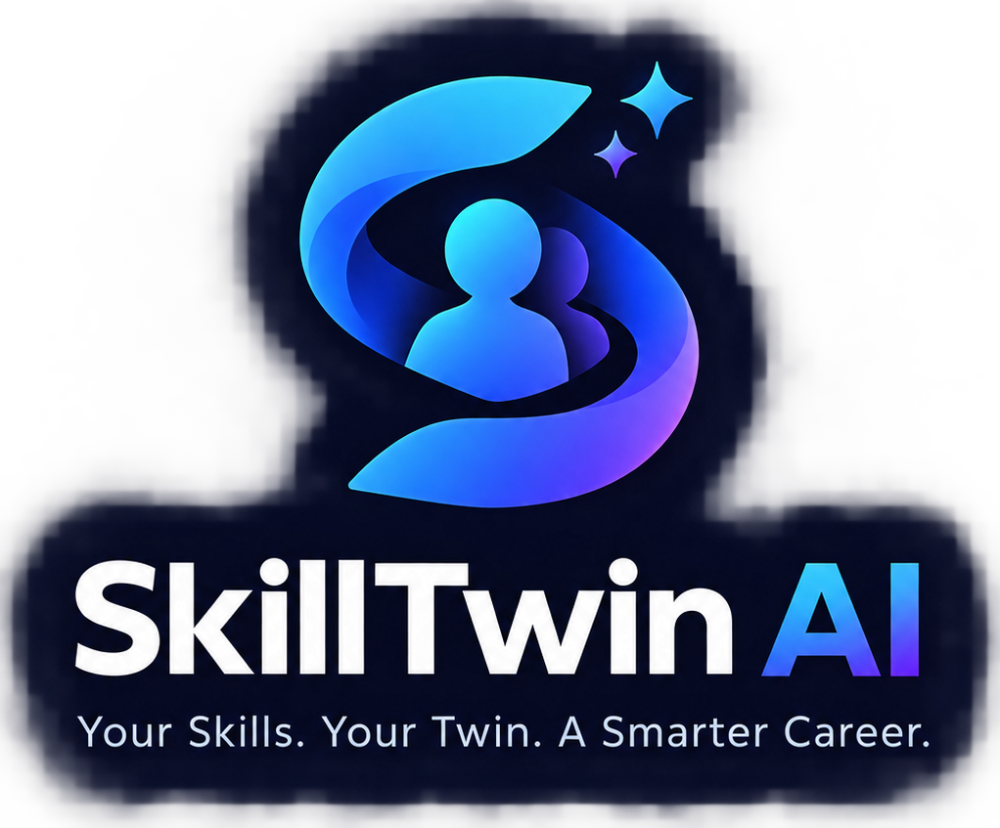

# 🧠 SkillTwin AI

<p align="center">
  
</p>

<p align="center">
  <strong>Your Skills. Your Twin. A Smarter Career.</strong>
</p>

<p align="center">
  From current skills to career readiness — understand your skill profile,
  identify gaps, simulate learning outcomes, and build a focused career roadmap.
</p>

<p align="center">

  

  

  

  

  

  

</p>

---

## 🌐 Project Overview

**SkillTwin AI** is a career intelligence platform designed to transform a user's existing skills and resume information into a structured digital **Skill Twin**.

Instead of simply showing a list of missing skills, SkillTwin AI is designed around a more useful question:

> **"What should I learn next — and what could it unlock?"**

The platform connects:

```text
Resume
   ↓
Skill Extraction
   ↓
Digital Skill Twin
   ↓
Target Role
   ↓
Skill Gap Analysis
   ↓
What-If Simulation
   ↓
Priority Skills
   ↓
Career Roadmap
````

The current version combines a React/Vite frontend with a FastAPI backend and persistent profile storage.

---

# ✨ Core Concept

SkillTwin AI represents a person's career skills as a dynamic profile.

### Traditional approach

```text
Resume
  ↓
Skills List
  ↓
Generic Course Recommendations
```

### SkillTwin approach

```text
Resume
  ↓
Structured Profile
  ↓
Skill Twin
  ↓
Target Career
  ↓
Industry Skill Requirements
  ↓
Gap Analysis
  ↓
"What If I Learn This?"
  ↓
Impact Simulation
  ↓
Personalized Roadmap
```

---

# 🚀 Features

## 🧾 1. Resume Upload & Processing

Users can upload supported resume files:

* PDF
* DOCX

The backend processes the uploaded document and extracts available information such as:

* Name
* Education
* Skills
* Technical technologies
* Domains
* Experience information
* Projects
* Certifications

Supported resume processing currently uses:

* `pypdf`
* `python-docx`

---

## 🧠 2. Skill Extraction

SkillTwin AI currently contains a structured skill catalog and rule-based extraction engine.

The current catalog includes technologies and domains such as:

* Python
* JavaScript
* TypeScript
* Java
* C
* C++
* SQL
* Excel
* Git
* React
* Next.js
* Node.js
* FastAPI
* Django
* Machine Learning
* Deep Learning
* Data Analysis
* Statistics
* Power BI
* Tableau
* Docker

The system also supports aliases and contextual proficiency detection.

Example:

```text
Resume
   ↓
"Built React applications using JavaScript and Node.js"
   ↓
React
JavaScript
Node.js
```

---

# 🆔 3. Persistent SkillTwin ID

Each processed profile receives a unique SkillTwin ID.

Example:

```text
ST0001PDHAI
```

The ID follows the general format:

```text
ST + Sequence + Name Code
```

Example:

```text
ST0001PDHAI
│  │    │
│  │    └── Generated name code
│  └─────── Profile sequence
└────────── SkillTwin prefix
```

This allows an existing profile to be reopened without uploading the resume again.

### Existing Profile Flow

```text
SkillTwin ID
     ↓
Backend
     ↓
Profile Lookup
     ↓
Saved Profile
     ↓
Dashboard
```

---

# 🔁 4. Resume Re-upload Detection

SkillTwin AI generates a SHA-256 fingerprint for the uploaded resume.

```text
Resume File
    ↓
SHA-256
    ↓
Resume Hash
    ↓
Existing Profile?
   ↙       ↘
 YES       NO
 ↓          ↓
Update    Create
```

If the exact same resume is uploaded again, the system can recognize it using the stored hash.

---

# 👤 5. Existing Profile Access

Users who already have a SkillTwin ID can reopen their profile.

Example:

```text
ST0001PDHAI
```

The system retrieves the saved profile through:

```http
GET /api/profile/{skilltwin_id}
```

Example:

```http
GET /api/profile/ST0001PDHAI
```

---

# 📊 6. Skill Twin Dashboard

The dashboard provides a central overview of the user's career profile.

It is designed around:

* Current skills
* Skill strength
* Skill gaps
* Target role
* Match information
* Priority skills
* Career roadmap
* Industry information

---

# 🎯 7. Skill Gap Analysis

SkillTwin compares the user's available skills against target-role requirements.

Skills can be categorized conceptually as:

```text
🟢 Strong Match
🟡 Partial Match
🔴 Missing
```

Example:

```text
Data Analyst

Python       🟢 Strong
Excel        🟢 Strong
SQL          🔴 Missing
Power BI     🔴 Missing
Statistics   🟡 Partial
```

---

# 🧪 8. What-If Simulator

One of SkillTwin AI's central concepts is the **What-If Simulator**.

Instead of simply saying:

> "You are missing SQL."

the system can simulate:

> "What happens to your match if SQL is added?"

Example:

```text
Current Match
     57%
      │
      │ + SQL
      ▼
Simulated Match
     68%
```

This helps visualize the potential impact of learning a particular skill.

---

# 🗺️ 9. Career Roadmap

SkillTwin AI includes a roadmap experience designed around the user's identified skill gaps.

The prototype includes a:

```text
30-Day Career Roadmap
```

The roadmap can organize learning into focused stages based on priority skills.

Example:

```text
Week 1
SQL Fundamentals

        ↓

Week 2
SQL Queries + Data Analysis

        ↓

Week 3
Advanced SQL

        ↓

Week 4
SQL Project
```

---

# 📡 10. Industry Intelligence

The Industry section is designed to visualize:

* Skill demand
* Job demand
* Emerging technologies
* Role requirements
* Industry trends

The current prototype uses prepared data sources for this experience.

---

# 🧮 11. Match Scoring

The frontend contains a scoring system designed around skill alignment.

The conceptual model considers factors such as:

```text
Skill Demand
     ×
Skill Relevance
     ×
Skill Gap
     ×
Potential Score Impact
```

The resulting information is used throughout:

* Skill Gap Analysis
* Dashboard
* Simulator
* Priority Skills
* Roadmap

> **Note:** Current scores are prototype alignment metrics and should not be interpreted as official employment probabilities or guarantees.

---

# 🎨 12. Modern Career Intelligence UI

The interface uses a dark, futuristic career-tech visual language.

Design characteristics include:

* Dark navy background
* Indigo gradients
* Cyan accents
* Glassmorphism cards
* Responsive navigation
* Animated transitions
* Skill visualization
* Interactive dashboards
* Mobile navigation
* Responsive layouts

---

# 📱 13. Responsive Design

SkillTwin AI supports:

```text
Desktop
   ↓
Sidebar Navigation

Tablet
   ↓
Responsive Layout

Mobile
   ↓
Mobile Top Bar
   +
Bottom Navigation
```

Mobile navigation includes:

* Overview
* Skill Twin
* Skill Gaps
* Simulator
* Roadmap
* Industry

---

# 🧩 Application Modules

The application currently contains the following major pages:

| Page       | Purpose                                |
| ---------- | -------------------------------------- |
| Landing    | Product introduction                   |
| Onboarding | Resume processing and profile creation |
| Dashboard  | Career intelligence overview           |
| Skill Twin | Digital skill profile                  |
| Skill Gaps | Skill comparison and gap analysis      |
| Simulator  | What-if skill simulation               |
| Roadmap    | Learning roadmap                       |
| Industry   | Industry demand and trends             |
| Profile    | User profile                           |

---

# 🏗️ Architecture

```text
┌──────────────────────────────────────────────┐
│                  SkillTwin AI                │
└──────────────────────────────────────────────┘

                    Frontend
                       │
                       ▼
             ┌──────────────────┐
             │ React + TypeScript│
             │      + Vite      │
             └────────┬─────────┘
                      │
                REST API
                      │
                      ▼
             ┌──────────────────┐
             │     FastAPI      │
             │     Backend      │
             └────────┬─────────┘
                      │
          ┌───────────┼────────────┐
          ▼           ▼            ▼
     Resume Parser  Skill      Profile
                    Engine      Store
          │           │            │
          ▼           ▼            ▼
        PDF/DOCX   Skill Data   profiles.json
```

---

# 📁 Project Structure

```text
SkillTwin AI/
│
├── public/
│   └── assets/
│       └── skilltwin-logo.png
│
├── src/
│   ├── components/
│   │   ├── common/
│   │   ├── dashboard/
│   │   ├── industry/
│   │   ├── layout/
│   │   │   ├── MobileNav.tsx
│   │   │   ├── Sidebar.tsx
│   │   │   └── TopBar.tsx
│   │   ├── onboarding/
│   │   ├── roadmap/
│   │   ├── simulator/
│   │   └── skill-gaps/
│   │
│   ├── data/
│   │   ├── industryTrends.ts
│   │   ├── jobDemand.ts
│   │   ├── roadmaps.ts
│   │   ├── roles.ts
│   │   ├── skills.ts
│   │   └── users.ts
│   │
│   ├── hooks/
│   │   ├── useAppContext.tsx
│   │   └── useSkillTwin.ts
│   │
│   ├── pages/
│   │   ├── Dashboard.tsx
│   │   ├── Industry.tsx
│   │   ├── Landing.tsx
│   │   ├── Onboarding.tsx
│   │   ├── Profile.tsx
│   │   ├── Roadmap.tsx
│   │   ├── Simulator.tsx
│   │   ├── SkillGaps.tsx
│   │   └── SkillTwin.tsx
│   │
│   ├── services/
│   │   ├── api.ts
│   │   ├── profileApi.ts
│   │   ├── scoring.ts
│   │   ├── simulation.ts
│   │   └── skillEngine.ts
│   │
│   ├── types/
│   │   └── index.ts
│   │
│   ├── utils/
│   │   └── formatting.ts
│   │
│   ├── App.tsx
│   ├── index.css
│   └── main.tsx
│
├── backend/
│   ├── app/
│   │   ├── api/
│   │   │   ├── health.py
│   │   │   ├── profile.py
│   │   │   └── resume.py
│   │   │
│   │   ├── schemas/
│   │   │   ├── health.py
│   │   │   └── profile.py
│   │   │
│   │   ├── services/
│   │   │   ├── profile_identity.py
│   │   │   ├── profile_store.py
│   │   │   ├── resume_parser.py
│   │   │   └── skill_extractor.py
│   │   │
│   │   ├── config.py
│   │   └── main.py
│   │
│   ├── data/
│   │   └── profiles.json
│   │
│   └── .venv/
│
├── index.html
├── package.json
├── tailwind.config.js
├── tsconfig.json
├── vite.config.ts
└── README.md
```

---

# ⚙️ Technology Stack

## Frontend

| Technology   | Purpose                   |
| ------------ | ------------------------- |
| React        | UI framework              |
| TypeScript   | Type safety               |
| Vite         | Development/build tooling |
| React Router | Application routing       |
| Tailwind CSS | Styling                   |
| Recharts     | Data visualization        |
| Lucide React | Icons                     |

## Backend

| Technology  | Purpose          |
| ----------- | ---------------- |
| Python      | Backend language |
| FastAPI     | REST API         |
| Pydantic    | Data validation  |
| pypdf       | PDF parsing      |
| python-docx | DOCX parsing     |
| Uvicorn     | ASGI server      |

## Current Storage

The current backend uses:

```text
backend/data/profiles.json
```

for persistent profile storage.

---

# 🔌 API

The backend currently runs on:

```text
http://localhost:8001
```

API prefix:

```text
/api
```

---

## Health Check

### Request

```http
GET /api/health
```

### Response

```json
{
  "status": "ok",
  "service": "SkillTwin AI API",
  "version": "1.0.0"
}
```

---

# 📄 Upload Resume

### Request

```http
POST /api/profile/resume
```

Multipart form:

```text
file=<resume.pdf>
```

Supported:

```text
.pdf
.docx
```

The backend:

```text
Receive File
    ↓
Validate Extension
    ↓
Read File
    ↓
Generate SHA-256
    ↓
Parse Resume
    ↓
Extract Name
    ↓
Extract Education
    ↓
Extract Skills
    ↓
Find Existing Profile
    ↓
Create / Update Profile
```

---

# 👤 Get Profile

### Request

```http
GET /api/profile/{skilltwin_id}
```

Example:

```http
GET /api/profile/ST0001PDHAI
```

### Example Response

```json
{
  "profile": {
    "id": "profile-1",
    "skilltwin_id": "ST0001PDHAI",
    "name": "PROBAL DHALI",
    "education": "EDUCATION",
    "experience": [],
    "projects": [],
    "certifications": [],
    "target_role": "",
    "skills": [],
    "resume_hash": "..."
  },
  "existing": true
}
```

---

# 🛠️ Local Installation

## Requirements

Make sure you have:

```text
Node.js
npm
Python 3.x
pip
```

---

# 1️⃣ Clone the Repository

```bash
git clone https://github.com/probal2005/SkillTwin-AI.git
```

```bash
cd "SkillTwin AI"
```

> Replace the repository URL if your GitHub repository uses a different name.

---

# 2️⃣ Install Frontend Dependencies

```bash
npm install
```

---

# 3️⃣ Create Backend Virtual Environment

```bash
cd backend

python3 -m venv .venv
```

Activate it:

```bash
source .venv/bin/activate
```

---

# 4️⃣ Install Backend Dependencies

```bash
pip install fastapi "uvicorn[standard]" pydantic-settings python-multipart pypdf python-docx
```

---

# 5️⃣ Start Backend

From the project root:

```bash
cd ~/Downloads/"SkillTwin AI"
```

Activate the environment:

```bash
source backend/.venv/bin/activate
```

Start FastAPI:

```bash
uvicorn backend.app.main:app --reload --host 0.0.0.0 --port 8001
```

Backend:

```text
http://localhost:8001
```

API:

```text
http://localhost:8001/api
```

---

# 6️⃣ Start Frontend

Open another terminal:

```bash
cd ~/Downloads/"SkillTwin AI"
```

Run:

```bash
npm run dev
```

Frontend:

```text
http://localhost:5173
```

---

# 🧪 Development Commands

## Start frontend

```bash
npm run dev
```

## Type check

```bash
npm run typecheck
```

## Production build

```bash
npm run build
```

## Preview production build

```bash
npm run preview
```

## Lint

```bash
npm run lint
```

---

# 🔍 Testing the Backend

## Health

```bash
curl http://localhost:8001/api/health
```

Expected:

```json
{
  "status": "ok",
  "service": "SkillTwin AI API",
  "version": "1.0.0"
}
```

---

## Test Existing SkillTwin ID

```bash
curl http://localhost:8001/api/profile/ST0001PDHAI
```

---

# 🧠 Skill Extraction Architecture

The current skill extraction engine is primarily rule-based.

```text
Resume Text
     │
     ▼
Normalization
     │
     ▼
Skill Catalog
     │
     ▼
Alias Matching
     │
     ▼
Context Detection
     │
     ▼
Proficiency Estimation
     │
     ▼
Structured Skills
```

Example:

```text
"Developed REST APIs using Python and FastAPI"
```

can result in:

```json
[
  {
    "name": "Python",
    "category": "Language"
  },
  {
    "name": "FastAPI",
    "category": "Framework"
  }
]
```

---

# 💾 Current Profile Storage

Profiles are currently persisted in:

```text
backend/data/profiles.json
```

Example structure:

```json
{
  "next_sequence": 2,
  "profiles": [
    {
      "id": "profile-1",
      "skilltwin_id": "ST0001PDHAI",
      "name": "PROBAL DHALI",
      "skills": []
    }
  ]
}
```

This makes the current prototype persistent across backend restarts.

---

# 🔐 Current Security Model

The current prototype does **not** implement full authentication.

A SkillTwin ID currently acts as a profile lookup identifier.

Therefore:

```text
SkillTwin ID ≠ Password
SkillTwin ID ≠ Authentication
```

For production deployment, the platform should introduce:

* User authentication
* Email verification
* Passwordless login
* OAuth
* Secure sessions
* Authorization
* Database-level access control
* API rate limiting
* File validation
* Secure file storage

---

# 🧪 Current Project Status

### Frontend

```text
🟢 React UI
🟢 Responsive Design
🟢 Routing
🟢 Dashboard
🟢 Skill Twin
🟢 Skill Gap Analysis
🟢 What-If Simulator
🟢 Roadmap
🟢 Industry Dashboard
🟢 Profile Page
🟢 Mobile Navigation
🟢 Custom Branding
```

### Backend

```text
🟢 FastAPI
🟢 Health API
🟢 Resume Upload
🟢 PDF Parsing
🟢 DOCX Parsing
🟢 Skill Extraction
🟢 Profile Creation
🟢 Profile Updating
🟢 SkillTwin ID Generation
🟢 Resume Hash Detection
🟢 Profile Lookup
🟢 JSON Persistence
```

### Production-Level Features Still To Be Added

```text
🟡 Authentication
🟡 PostgreSQL / Supabase
🟡 Cloud File Storage
🟡 Production AI Skill Extraction
🟡 Real Job Market Data
🟡 Live Industry Data
🟡 Job API Integration
🟡 Advanced Resume Understanding
🟡 Recommendation Engine
🟡 Secure Profile Recovery
🟡 Background Processing
🟡 Production Deployment
```

---

# 🚀 Roadmap

## Phase 1 — Prototype

```text
[x] UI/UX
[x] Landing Page
[x] Dashboard
[x] Skill Twin
[x] Skill Gap
[x] Simulator
[x] Roadmap
[x] Industry
[x] Resume Upload
[x] FastAPI Backend
[x] Profile Persistence
[x] SkillTwin ID
```

---

## Phase 2 — Real AI

```text
[ ] LLM-powered resume understanding
[ ] Semantic skill extraction
[ ] Skill normalization
[ ] Experience understanding
[ ] Project understanding
[ ] Certification understanding
[ ] Context-aware proficiency estimation
```

---

## Phase 3 — Real Industry Intelligence

```text
[ ] Live job data
[ ] Job description ingestion
[ ] Skill frequency analysis
[ ] Industry trend detection
[ ] Role-specific requirements
[ ] Location-aware demand
[ ] Salary intelligence
```

---

## Phase 4 — Personalization

```text
[ ] Personalized learning recommendations
[ ] Learning resource matching
[ ] Course recommendations
[ ] Project recommendations
[ ] Career path simulation
[ ] Skill dependency graph
[ ] Personalized roadmap generation
```

---

## Phase 5 — Production Infrastructure

```text
[ ] PostgreSQL
[ ] Supabase / managed database
[ ] Authentication
[ ] Secure file storage
[ ] Background workers
[ ] Redis caching
[ ] API rate limiting
[ ] Monitoring
[ ] Logging
[ ] Automated testing
[ ] CI/CD
```

---

# 🤖 Future AI Architecture

The planned production architecture can evolve into:

```text
                     ┌───────────────┐
                     │    Resume     │
                     │      PDF      │
                     │     DOCX      │
                     └───────┬───────┘
                             │
                             ▼
                  ┌────────────────────┐
                  │ Resume Intelligence│
                  │      Engine        │
                  └─────────┬──────────┘
                            │
                            ▼
                  ┌────────────────────┐
                  │  Skill Extraction  │
                  │   + Normalization  │
                  └─────────┬──────────┘
                            │
                            ▼
                  ┌────────────────────┐
                  │     Skill Twin     │
                  └─────────┬──────────┘
                            │
              ┌─────────────┼─────────────┐
              ▼             ▼             ▼
        Industry Data   Target Role   User Goals
              │             │             │
              └─────────────┼─────────────┘
                            ▼
                  ┌────────────────────┐
                  │   Skill Gap Engine │
                  └─────────┬──────────┘
                            │
                            ▼
                  ┌────────────────────┐
                  │  What-If Simulator │
                  └─────────┬──────────┘
                            │
                            ▼
                  ┌────────────────────┐
                  │ Recommendation AI  │
                  └─────────┬──────────┘
                            │
                            ▼
                  ┌────────────────────┐
                  │ Career Roadmap AI  │
                  └────────────────────┘
```

---

# 🌟 Why SkillTwin AI?

Most career platforms answer:

> **"What skills are required?"**

SkillTwin AI aims to answer a different question:

> **"Given where I am today, what happens if I learn this next?"**

The platform therefore focuses on:

```text
Understand
    ↓
Compare
    ↓
Simulate
    ↓
Prioritize
    ↓
Act
```

---

# 📸 Product Experience

### Landing Page

```text
From Current Skills
to Career Readiness
```

The landing page introduces:

* Career Intelligence Platform
* Skill Twin concept
* Skill Gap analysis
* What-If simulation
* Roadmap generation
* Industry intelligence

---

### Onboarding

```text
Upload Resume
      ↓
Analyze Resume
      ↓
Skill Extraction
      ↓
SkillTwin ID
      ↓
Dashboard
```

Existing users can also enter their:

```text
SkillTwin ID
```

to reopen their saved profile.

---

# 🧑‍💻 Example User Journey

Imagine a student has:

```text
Python
JavaScript
React
Machine Learning
Git
```

but wants to move toward:

```text
Data Analyst
```

SkillTwin can represent the current profile:

```text
Current Skills
──────────────
Python       ✓
React        ✓
JavaScript   ✓
Git          ✓
SQL          ✕
Power BI     ✕
Statistics   ~
```

The platform can then identify gaps:

```text
Missing
───────
SQL
Power BI

Partial
───────
Statistics
```

The simulator can then model:

```text
Current Match
     57%

     + SQL

Simulated Match
     68%
```

The roadmap can then organize the next learning steps.

---

# 📈 Example SkillTwin

```text
┌─────────────────────────────────────┐
│           SKILLTWIN AI              │
├─────────────────────────────────────┤
│                                     │
│  Profile: ST0001PDHAI               │
│                                     │
│  Python          ████████░░          │
│  JavaScript      ███████░░░          │
│  React           ██████░░░░          │
│  Git             █████░░░░░          │
│  SQL             ░░░░░░░░░░          │
│                                     │
│  Target Role: Data Analyst          │
│                                     │
│  Skill Gap: 3                       │
│  Priority Skills: SQL, Power BI     │
│                                     │
└─────────────────────────────────────┘
```

---

# 🧪 Prototype Data Notice

Some current dashboard data is prepared prototype/demo data.

Therefore:

* Industry statistics are not necessarily live.
* Job demand values are prototype data.
* Match scores are illustrative.
* Simulator outputs are prototype calculations.
* Roadmap content is currently structured/prepared data.

The platform architecture is designed so these components can later be connected to live data sources and production AI services.

---

# 🛡️ Privacy Considerations

Resume files can contain sensitive personal information.

A production deployment should implement:

* Encrypted storage
* Secure uploads
* Access control
* Automatic file expiration options
* Data deletion
* User-controlled profile management
* Privacy policy
* Consent management
* Secure database rules
* Audit logging

The current prototype is intended for local development and demonstration.

---

# 🧑‍💻 Development Workflow

Recommended development flow:

```text
1. Start FastAPI
        ↓
2. Start Vite
        ↓
3. Test frontend
        ↓
4. Test backend APIs
        ↓
5. Upload resume
        ↓
6. Verify SkillTwin ID
        ↓
7. Verify profile persistence
        ↓
8. Run typecheck
        ↓
9. Run production build
```

---

# 🐛 Troubleshooting

## Frontend cannot connect to backend

Check:

```bash
curl http://localhost:8001/api/health
```

If successful, verify the frontend API URL.

Current API:

```text
http://localhost:8001/api
```

---

## Backend not starting

Activate the virtual environment:

```bash
source backend/.venv/bin/activate
```

Then:

```bash
uvicorn backend.app.main:app --reload --host 0.0.0.0 --port 8001
```

---

## `ModuleNotFoundError`

Install backend dependencies:

```bash
pip install fastapi "uvicorn[standard]" pydantic-settings python-multipart pypdf python-docx
```

---

## Vite not found

Run:

```bash
npm install
```

Then:

```bash
npm run dev
```

---

## TypeScript errors

Run:

```bash
npm run typecheck
```

---

# 📦 Production Build

Build the frontend:

```bash
npm run build
```

The generated production files are placed in:

```text
dist/
```

Preview:

```bash
npm run preview
```

---

# 🌍 Deployment Vision

The intended production architecture can eventually look like:

```text
                     Internet
                         │
                         ▼
                ┌─────────────────┐
                │    Frontend     │
                │ Vercel / CDN    │
                └────────┬────────┘
                         │
                         ▼
                ┌─────────────────┐
                │   API Gateway   │
                └────────┬────────┘
                         │
              ┌──────────┼──────────┐
              ▼          ▼          ▼
          FastAPI      AI Layer   Auth
              │          │          │
              └──────────┼──────────┘
                         ▼
                ┌─────────────────┐
                │   PostgreSQL    │
                └────────┬────────┘
                         │
                         ▼
                ┌─────────────────┐
                │ Secure Storage  │
                └─────────────────┘
```

---

# 🔮 Future Vision

SkillTwin AI can evolve from a prototype into a complete career intelligence system.

Potential future capabilities include:

```text
Resume Intelligence
        +
Live Job Market
        +
Skill Knowledge Graph
        +
AI Career Agent
        +
Learning Resources
        +
Project Recommendations
        +
Career Simulation
```

Ultimately:

```text
YOUR CURRENT SKILLS
        ↓
YOUR SKILL TWIN
        ↓
YOUR TARGET CAREER
        ↓
YOUR SKILL GAPS
        ↓
YOUR POSSIBLE NEXT MOVES
        ↓
YOUR PERSONALIZED ROADMAP
```

---

# 🤝 Contributing

Contributions are welcome.

### Fork the repository

```bash
git fork
```

### Create a branch

```bash
git checkout -b feature/your-feature
```

### Make changes

```bash
npm run typecheck
npm run build
```

### Commit

```bash
git add .
git commit -m "feat: add your feature"
```

### Push

```bash
git push origin feature/your-feature
```

Then open a Pull Request.

---

# 📜 License

This project is currently intended as a prototype / development project.

Add an appropriate open-source license before distributing the project publicly.

---

# 👨‍💻 Developer

### Probal Dhali

AIML Student | Web Developer | Software Engineer in Progress

GitHub:

**probal2005**

---

# ⭐ Support

If you find the project interesting:

* ⭐ Star the repository
* 🍴 Fork the project
* 🐛 Report issues
* 💡 Suggest features
* 🔧 Contribute improvements

---

<p align="center">
  <strong>SkillTwin AI</strong>
</p>

<p align="center">
  Your Skills. Your Twin. A Smarter Career.
</p>

<p align="center">
  <em>From Current Skills to Career Readiness.</em>
</p>
